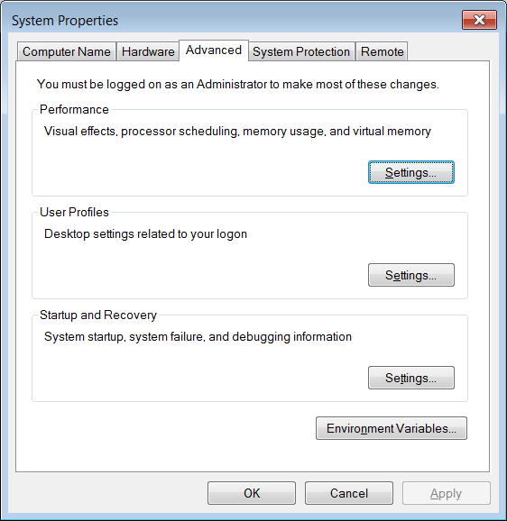
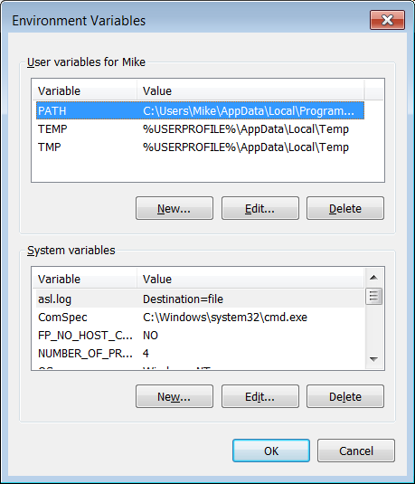
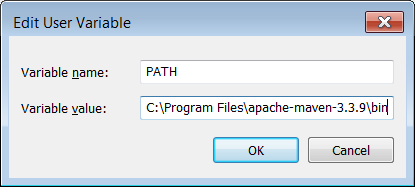
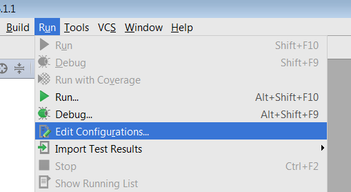
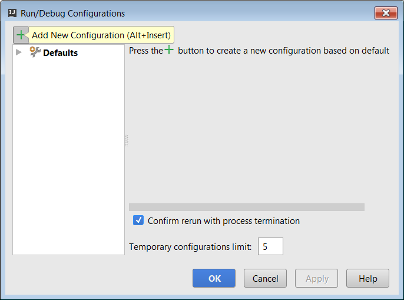
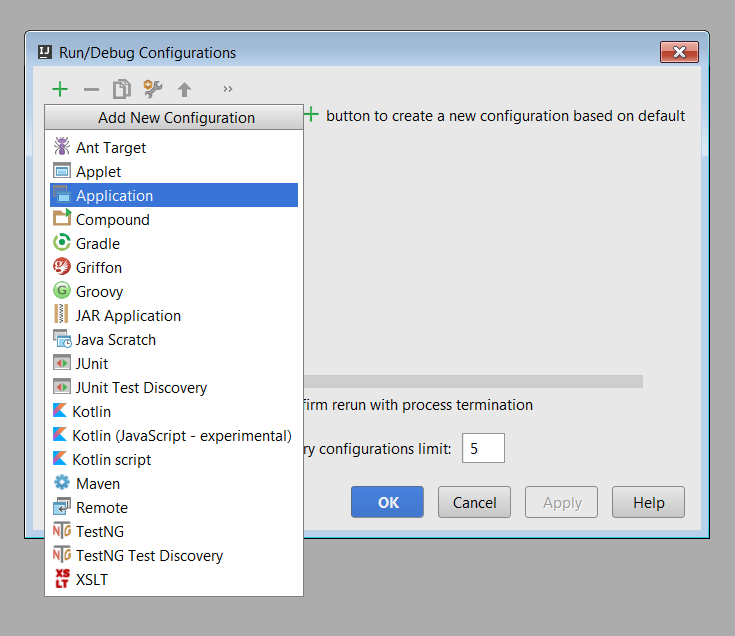
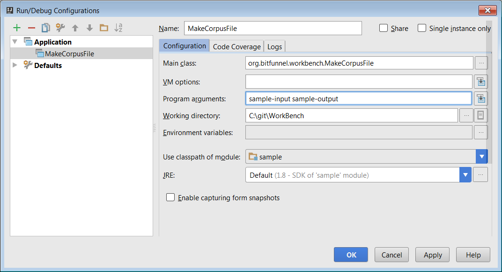
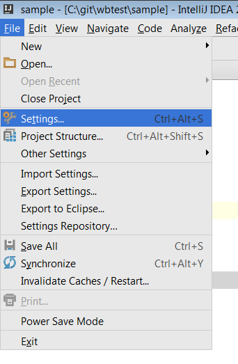

# Building Workbench

The **org.bitfunnel.workbench** package provides tools for converting
[Wikipedia](https://www.wikipedia.org/)
database dump files into BitFunnel corpus files. Please see [README.md](README.md)
for more information on using Workbench to process Wikipedia database dump files.

## Building org.bitfunnel.workbench.

Java development requires a JDK ((we used jdk1.8.0_92).
Our package is built with [Maven](https://maven.apache.org/).
(version 3.3.9).
The unit tests are based on [JUnit](http://junit.org/).

### OSX Configuration and Build
Install a JDK. We used Oracle's **Java SE 8u92** which can be
found on their [downloads page](http://www.oracle.com/technetwork/java/javase/downloads/index.html).

If you don't want to manually install the exact version we used, you can take your chances with the version of Java you'll get with homebrew; the following commands worked on 8/9/2016 with 10.11.5 (El Capitan), but there's guarnatee that the build will continue to work with future updates:
~~~
brew update
brew cask install java
~~~

Use homebrew to install Maven:
~~~
% brew install maven
~~~

Build org.bitfunnel.workbench from the command line:
~~~
% mvn package
~~~

### Windows Configuration and Build

Install a JDK. We used Oracle's **Java SE 8u92** which can be
found on their [downloads page](http://www.oracle.com/technetwork/java/javase/downloads/index.html).

Install Maven.

1. Download the Maven [.zip file](https://maven.apache.org/download.cgi).
1. Extract to some location on the machine.
1. Add the extracted folder's bin directory to the PATH.
  1. Open the System Control panel by pressing (Windows + Pause).
  
  1. Choose **Advanced System Settings** on the left.
  
  1. Click **Environment Varables** at the bottom of the dialog.
  
  1. Select the variable called **PATH** and press **Edit...**
  
  1. Add a semicolon (;) to the PATH and then the path to the extracted bin folder.
  
  1. **OK** out of all of the dialogs.
  1. Close and reopen any cmd.exe windows to get the new PATH.
  1. Tip. You can update the path in an open cmd.exe window, for example
     ~~~
     set PATH=%PATH%;C:\C:\Program Files\apache-maven-3.3.9\bin
     ~~~

     This change will only have effect in the current window and only until it is closed.

1. In a similar manner, set the JAVA_HOME to point to your JDK. For example,
   ~~~
   set JAVA_HOME=C:\Program Files\Java\jdk1.8.0_92
   ~~~

Build org.bitfunnel.workbench from the command line:
~~~
% mvn package
~~~

### Linux Configuration and Build

~~~
sudo apt install openjdk-8-jdk python maven
mvn package
~~~

### IntelliJ Configuration and Build

[IntelliJ Community Edition](https://www.jetbrains.com/idea/)
is a fairly lightweight, free IDE for Java.
It has a good debugger, support for Ant, Maven, Gradle, and JUnit, and
it provides a number of nice code browsing and refactoring features.
IntelliJ is available on Linux, OSX, and Windows.

Start IntelliJ. From the welcome screen, select **open**:

Select **pom.xml** and press **OK**.

The project will be imported. Now set up the debug and run configurations by clicking on **Run => Edit Configurations ...**

The click the green **+** in the upper left corner to add a new configuration:

Select **Application**

On the configuration tab, choose a **Name** for the configuration, set the **Main class** field to
org.bitfunnel.workbench.MakeCorpusFile, and set the **Program arguments** to reference your
input and output directories. **OK** out of all of the dialogs.

If you plan to edit the pom.xml file, say to add additional dependencies, it helps to configure
auto import. To do this, go to **File => Settings ...**

Expand the tree on the left to **Build, Execution, Deployment/Build Tools/Maven/Importing**. Select
**Import Maven projects automatically.** **OK** out of the dialog.

You are now good to go! **Use Build => Make Project** to build and **Run => Run 'MakeCorpusFile' to run**.

Please see [README.md](README.md)
for more information on using Workbench to process Wikipedia database dump files.
